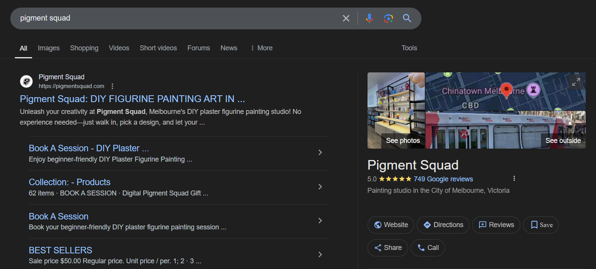

**NOTE: This project was part of my contractual work for the business, conducted with the approval and consent of the business owner for educational purposes. Certain information has been removed to protect the business's privacy.**

# Introduction

### About the Project
This project focuses on analyzing customer purchasing behavior and inventory trends for Pigment Squad, a retail startup specializing in unpainted and collectible figurines. The primary goal is to enable the business to make data-informed decisions — particularly in responding to seasonal demand, avoiding overstocking or stockouts, and reducing storage costs. The analysis aims to answer:

- Which products sell well?
- How quickly do they sell?
- And how consistently do they perform over time?

To achieve this, I designed an end-to-end reporting solution, using Power BI dashboards built on structured sales data and custom product classifications.

The final deliverable consists of multiple interactive dashboards that classify over 200 product types based on their performance. These dashboards give the business a dynamic and transparent view of which products to restock, monitor, or clear, all through a self-updating, user-friendly interface designed to support long-term growth.

### Case Study: Pigment Squad

Pigment Squad launched in April 2024, selling unpainted figurines both in-store and online, while offering an in-store table area for customers to paint on-site. Its product range is constantly evolving as new figurine types are introduced to test customer interest.

<table>
  <tr>
    <td align="center">
       
      <em>Fig. 1: Social Media</em>
    </td>
    <td align="center">
       
      <em>Fig. 2: Website</em>
    </td>
  </tr>
<table>

  

    
     
    <em>Fig. 1: Social Media</em>
  

  

    
     
    <em>Fig. 2: Website</em>
  

The business experiences fluctuations in demand, often tied to school breaks and promotional events, which cause sharp sales spikes followed by periods of slower activity.

Inventory decisions were previously made reactively based on recent impressions or sales memory to reorder stock. As the catalogue expanded, this approach became increasingly difficult and led to growing uncertainty around key questions:

- Which items should be consistently restocked?
- Which spikes were one-off or hype-driven?
- Which products are ready for clearance?

This project addresses those questions by providing a system that translates transaction data into actionable product insights.

### Project Challenge

The main challenge was to create a system that could:

- Track product demand behaviour over time
- Simplify restocking decisions through easy-to-understand labels
- Remain scalable, interactive, and usable by non-technical users, while still offering the depth needed to answer real business questions

This required balancing technical performance with clarity — building a solution that not only works behind the scenes but also communicates insights clearly to help the business make better decisions with confidence.

# Project Building

*For technical details and formulas, see the [Detailed Report section*]()*

- Data Preparation (R): Cleaned and standardised sales transactions, removed non-product entries, and unified inconsistent item names. Used string detection and manual corrections to classify product types.
- Model Design (Power BI): Created a semantic model using dimension and fact tables connected via primary and composite keys. Designed the model to support flexible filtering across product, time, and performance labels.
- Classification Logic (DAX): Developed a custom behaviour-based labelling system using sales frequency and stability logic. Applied the logic at both the 2-month and yearly levels using calculated tables.
- Dashboard Development: Built dynamic visuals, slicers, and drill-throughs that allow users to monitor product performance, compare periods, and explore transaction trends over time. 

# Results

You can download the Power BI dashboard [here](https://github.com/DongTran2003/Order-Trends-and-Volume-Analysis/blob/main/code/LeuleuReport.pbix):

### Sales Patterns and Seasonal Trends

  

    
     
    <em>Fig. 3: Yearly Overview Dashboard</em>
  

**Fast Movers vs. Consistent Performers**

- Over the **8-month** period, Pigment Squad sold **232** different product types, generating approximately **$280,000 AUD** through **6,650** online and in-store transactions. 
- A large portion of products (**23.71%**) were labeled **“Trending”** — fast-selling upon release but quickly losing momentum. These products bring excitement but pose forecasting challenges and inventory risk.
- In contrast, only **5.6%** of products were classified as **“Consistent”**, yet they delivered the highest transaction volumes, including:
  - **Teddy with Tote** – 271 transactions
  - **SP (Skull Panda) – Rabbit Trainer** – 250 transactions

*Fig. 4 Label Distribution by Year*

*Fig. 5 Top 10 Transactions by Product*

- These consistently performing products form the core inventory, crucial for maintaining baseline revenue outside of seasonal peaks.

**Seasonal Spike and Post-Peak Correction**

- Sales peaked during the **June–July**, with:
  - June – 1,407 transactions
  - July – 1,601 transactions 

    

*Fig. 6 Total Transactions by Month*

- Together, these two months accounted for over **45%** of total transactions, reflecting strong holiday-driven demand, especially from students and families.
- Transaction volume dropped by **729** in August, highlighting the return to baseline behavior and the importance of timely inventory preparation before peak period.

  

*Fig. 7 Change in Transactions by Month*

**Reliable Availability, Targeted Demand**

- Only **55** out of **232** products were available in every period, yet they contributed to more than half of all transactions **(3,550).**

  

*Fig. 8 Yearly Overview by Product Availability*

- Among these consistently available items:
  - **38.18%** were classified as **“High Potential”**, fast-selling but inconsistent
  - **30.91%** were labeled as **“Niche”**, occasional sales but with reliable demand over time
- This indicates a valuable mid-tier of products that serve loyal or targeted customer segments. While not top performers, they may benefit from focused promotion or controlled restocking to optimize their contribution.

### 3.2.Growth vs. Risk Across Cycles

The Period Overview page serves as a portfolio-level checkpoint, helping the business compare label movements across intervals and assess how recent restocking choices have impacted inventory performance.

*Fig. 9 Period Overview Dashboard*

- When the business introduced more growth-oriented products like **“Trending”** and **“High Potential”** items, it also saw an increase in poorly performing products (e.g., **Clearance**, **Low Potential**). This tradeoff diluted shelf space for reliable core items.

*Fig. 10 Label Distribution by Period (05/24 - 06/24)*

*Fig. 11 Label Distribution by Period (07/24 - 08/24)*

*Fig. 12 Label Distribution by Period (09/24 - 10/24)*

- This trend reflects Pigment Squad’s strategy of frequently introducing new or experimental products to spark customer interest and diversify offerings.
- While this approach helps drive early traction and uncover emerging favorites, it also expands the proportion of items that fail to sustain performance and demand.
- Without exit strategies or regular review cycles, a growing catalog can lead to higher holding costs, wasted shelf space, and weaker support for reliable core items.

### 3.3.Strategic Product Planning

The Yearly Profile dashboard functions as a strategic planning tool, summarizing product behavior across the full reporting period based on frequency and stability metrics.

*Fig. 13 Yearly Profile by Product Availability*

- Products that were available in every period accounted for over **50%** of all transactions, making them a priority group for inventory planning and performance optimization.
- To maintain a stable revenue base, the business should focus on restocking core products regularly, in this order: **Top Performer** → **Consistent** → **Slow but Reliable**
- Conversely, products labeled **“Clearance”** or **“Low Potential”**, especially those available year-round but with weak sales should be phased out or re-evaluated to improve inventory efficiency.
- Growth-oriented products, including **“Unpredictable”,** **“Trending”,** and **“High Potential”**, offer opportunities for expansion but should be monitored closely for signs of decline or improvement across periods.
- **“Niche”** products continue to show value in serving specific customer segments. These items are best managed through targeted promotions and occasional low-volume restocking, avoiding unnecessary inventory buildup.

### 3.4.Tactical Restocking and Monitoring 

The Period Profile dashboard acts as a short-term monitoring tool, enabling tactical decisions on what to restock, retire, or test. It tracks how labels shift over 2-month periods, providing timely feedback loops for performance review.

*Fig. 14 Period Profile Dashboard*

For example, to identify candidates for restocking, the dashboard can be used to identify fast-selling growth items with strong period-level performance.

- ***Bowtie Cat*** was unavailable during **July–August**, but after being restocked, it sold out quickly in the following period. This shows promising demand. The product should be monitored further, with a decision made at year-end about potential inclusion in the core group.

  

*Fig. 15 Period Profile for Bowtie Cat*

- ***Pokemon – Blas Turtle*** consistently sells out quickly whenever available, indicating reliable, repeatable demand. It is a strong candidate for promotion to regular restocking.

  

*Fig. 16 Period Profile for Pokemon – Blas Turtle*

### 3.5.Individual Product Diagnostics

The Product Drill-Through view provides detailed analysis of specific products over both the year and selected periods, validating label classifications and informing stocking decisions.

- For instance, in **Sep–Oct 2024**, ***Raws – Furry*** recorded the largest increase in transactions compared to its last appearance.

*Fig. 17 Period Overview: Top 10 Change in Transaction by Product*

- Sales were evenly distributed throughout the period, indicating sustained demand rather than a one-time spike. 

  

*Fig. 18 Drill-through Period: Raws - Furry (09/24 - 10/24)*

- In contrast, during **Jul–Aug 2024**, the product was stocked in small volumes for testing and sold out within the first two weeks - showing fast turnover, but a shorter engagement window.

  

*Fig. 19 Drill-through Year: Raws - Furry (2024)*

- This shift in pattern suggests that ***Raws – Furry*** may be transitioning into a more stable performer. It should be restocked in the next cycle and monitored closely for potential promotion into the core product group. 

# 4.Potential Business Actions

|**Goal**|**Action Summary**|**Implementation Details**|
| :- | :- | :- |
|Maintain Core Revenue|Restock top performers year-round|Restocking list, monitor stock levels|
|Eliminate Low Performers|Stop restocking clearance and low potential products|Set sales targets, run clearance sales|
|Monitor Growth Products|Review every 2 months|Use Period Profile & Period Overview dashboard|
|Promote Niche Products|Restock small batches, target loyal buyers|Highlight as “special edition” or “limited”|
|Prepare for Seasonal Peaks|Restock 4–6 weeks early|Use past sales to inform decisions|

# 5.Challenge During the Project

Before starting this project, I had never built a reporting system that classified products based on sales patterns or supported long-term inventory decisions. My technical skills with Power BI and DAX were still developing, and I had to learn how to structure a multi-page report that could deliver insights to both business owners and technical reviewers.

A key challenge was designing a product labeling logic that balanced clarity with flexibility. The definitions for product frequency, stability, and category labels went through multiple iterations before they became meaningful to the business. Testing these definitions across multiple dashboards, while ensuring they aligned with real sales behavior took time and required close attention to edge cases.

Another challenge was organizing the semantic model in Power BI to support filtering across all views. At first, I attempted to pull all labels directly into the daily transaction table, which created filtering errors and performance issues. I later restructured the model to use reference tables, improving both performance and report maintainability.

Throughout the project, I used AI tools like ChatGPT to accelerate learning and problem-solving. These tools were especially helpful when I needed help understanding how to design DAX measures, resolve model relationships, or interpret unexpected results. However, success still depended on human logic, for instance, adapting AI outputs to business context, checking against real data, and revising when things didn’t work as expected.

Despite these challenges, this project became a valuable learning experience. I gained hands-on skills in data modeling, dashboard design, and analytical storytelling, while helping the business owner understand customer demand and make more confident restocking decisions. Most importantly, it gave me the opportunity to support a small business in applying data-driven thinking to real-world problems. 

# 6.Conclusion

This project provided valuable insights into how different products behave over time and how the business can better manage its inventory based on real customer demand. By classifying products into performance-based labels and visualizing those trends in Power BI, the business can now make more informed decisions about restocking, clearance, and promotional strategies.

Through dashboard analysis, we identified patterns such as:

- The importance of maintaining core products to stabilize revenue
- The risks of over-reliance on short-term trending items
- The potential of niche and growth-oriented products when monitored properly
- The clear impact of seasonal spikes on overall transaction volume

These findings have helped the business shift from reactive to proactive restocking decisions and toward a data-supported restocking strategy that considers both stability and flexibility in the product portfolio.

Looking ahead, this product-level dataset can be integrated with financial metrics such as revenue, margins, and stock costs to uncover even deeper insights like the profitability of different product labels, or the cost of holding slow-moving stock.

This project demonstrates how small businesses can benefit from analytics systems tailored to their scale, and accessible tools like Power BI with well-defined business logic to turn raw sales data into actionable decisions. It also serves as a foundation for future analytics initiatives, such as demand forecasting, or cost optimization. 

# 7.Recommendations for Further Analysis

**Limitations of Current Dataset**

While this project successfully identified trends in product performance and demand behavior, a few limitations should be addressed in future analysis to improve reliability and expand insight:

1. **Single-Channel Focus:**\
   The dataset includes only transaction data — what was sold. It does not include information on available stock, storage inventory, or incoming shipments. This limits the ability to determine whether low sales were due to weak demand or simply product unavailability.
1. **New Business Effect:**\
   Since Pigment Squad launched in April 2024, current patterns may be shaped by initial novelty or first-time customer behavior. Over time, repeat purchasing and more stable trends may emerge, affecting product classification labels.
1. **Partial Year Coverage (May–October 2024):**\
   The analysis excludes November and December, which are typically high-volume months due to holiday sales, gifting, and seasonal clearance. This limits visibility into year-end performance and could miss important trends in customer behavior.

**Recommended Next Steps**

To strengthen the reporting system and further develop the project, I plan to extend the dataset to include November and December 2024, allowing for a more complete analysis of year-end seasonality, clearance behavior, and full-cycle product trends.

In addition, I aim to incorporate inventory availability and arrival data to better understand the relationship between stock levels and product performance, and to assess whether labels such as “*Low Potential”* or “*Clearance”* are driven by actual demand patterns or simply by limited product availability.

[ref1]: Aspose.Words.3f1d2683-21be-4e8c-9c8f-0e73f1272af4.001.png
